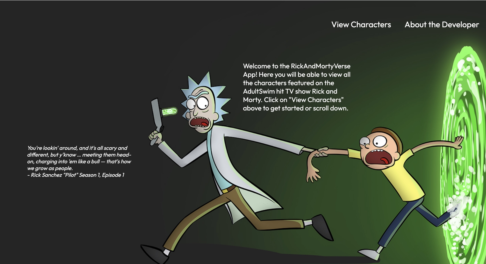
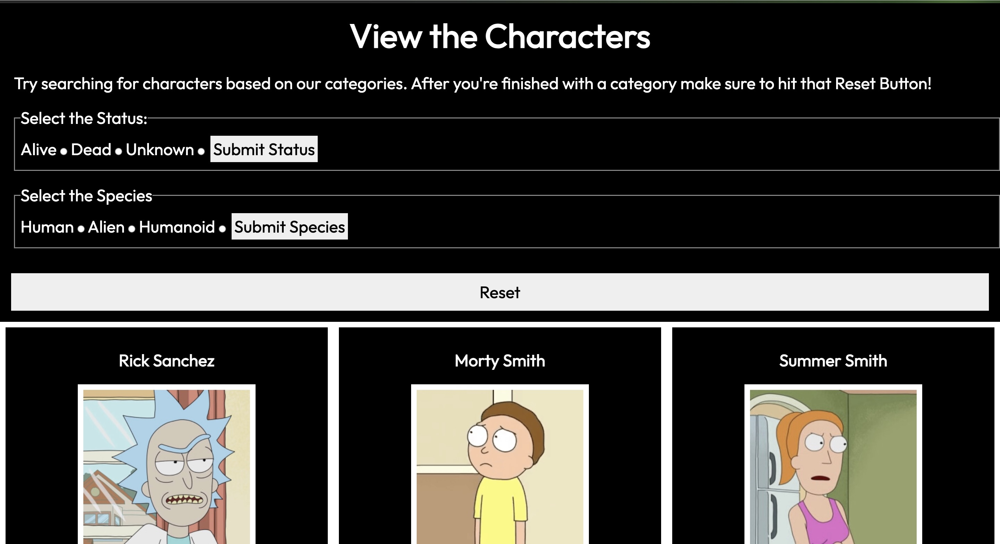

# RickAndMortyVerse App

## Introduction

Welcome to the RickAndMortyVerse App! This application welcomes all Rick and Morty fans, as well as those who haven't watched the show yet. Our web application offers a unique experience for users to explore the diverse characters within the Rick and Morty universe. Whether they are aliens, humans, or humanoids, we've got them all! This web application enables you to:

- View all the characters from the show in the form of a card with characteristics such as: species, status, origin, gender and where they were last seen.
- Filter the characters based on their status: alive, dead and unknown
- Filter the characters based on their species: human, alien, humanoid
- Reset the search filter
- Learn more about the show
- Get to know the developer of the website

## Installation

Fork and Clone this repository.

Open the repository in VS Code by using this command in the terminal.
`code .`

## Usage
In this part of the file you will learn exactly how to use the web application to it's full extent.

### Filtering Status/Filtering Species:
When using the application you are able to filter through the characters based on their status or species. However, you can only use each fieldset one at a time. You can toggle between the buttons through the status and then hit submit. However, when you would like to filter species you must hit reset. Then you can procceed with your selection and vice versa. 

## Additional
We are also mobile-friendly! So make sure to check out our mobile application.

Make sure to check out the "About the Developer" section!

Credits to [Rick and Morty API:](https://rickandmortyapi.com/)
For further information click the link above.